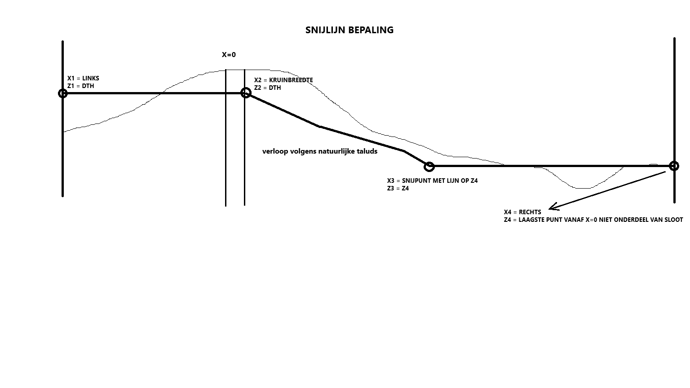

# werkwijze

## invoer

### STIX Bestanden en filtering

* Plaats alle originele stix bestanden in 1 map
* Maak directories aan volgens de paden die in het bestand settings.py te vinden zijn

### CSV en SHAPE bestanden

De volgende bestanden zijn benodigd (paden opgeven in settings.py);

* CSV bestand met DTH waardes
* CSV bestand met onderhoudsdieptes 
* CSV bestand met IPO klasses

### Uitgangspunten 

In het settings bestand staan een aantal vastgestelde constante waardes. Deze kunnen eventueel aangepast worden.

## Werkwijze

De snijlijn met de bestaande geometrie wordt bepaald via de volgende procedure;

## Uitvoer

